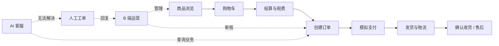

# CBEC · 跨境电商全栈系统

<p align="center">
  <strong>从商品运营，到用户下单，再到 AI 客服接管的完整业务闭环</strong><br>
  Java 23 · Spring Boot · Vue 3 · MySQL · Redis · RabbitMQ · Elasticsearch · FastAPI
</p>

<p align="center">
  
  
  
  
</p>

> 一个面向跨境零售场景的 B2C 全栈项目：B 端负责运营管理，C 端承载交易闭环，AI 服务提供可追溯的智能客服与人工接管。

## 项目一览

| 端 | 工程 | 当前能力 |
| --- | --- | --- |
| B 端 | `mall-web/` | 商品、订单、会员、营销、财务、系统管理、客服工单 |
| C 端 | `mall-storefront/` | 商品目录、购物车、结算、税费、优惠券、订单、物流、售后 |
| AI | `mall-ai-service/` | SSE 对话、FAQ 检索、只读业务工具、来源依据、转人工 |
| 后端 | `src/main/java/com/mall/` | 单模块 Spring Boot，按领域组织业务代码 |

## 业务闭环



## 核心特性

- **交易安全**：结算快照、库存预占与释放、订单归属校验、支付金额校验、条件更新与幂等处理。
- **运营协同**：JWT + Spring Security + RBAC，覆盖商品、订单、会员、营销、财务与客服处理流程。
- **搜索与异步**：Elasticsearch 商品搜索失败时回退 MySQL；Redis 负责缓存/锁，RabbitMQ 负责业务事件解耦。
- **AI 可控**：模型负责理解与表达，Java 侧负责鉴权、资源归属、工具白名单和业务事实；无模型时保留本地兜底。
- **人工接管**：C 端可转平台客服，B 端支持认领、回复、解决，消息与会话可恢复。
- **响应式前台**：移动优先，桌面端自动切换导航与商品网格布局。

## 技术架构

```text
mall-web / mall-storefront
          │ REST + SSE
          ▼
Spring Boot 3.2.5（Java 23）
  product · order · trade · member · marketing · finance · search · security
          │                 │ HTTP + SSE
          ▼                 ▼
MySQL · Redis · RabbitMQ   FastAPI + LangGraph
Elasticsearch · MinIO      FAQ/RAG · Tool Plan · AI Chat
```

## 快速开始

### 1. 准备环境

- Java 23
- Maven 3.9+
- Node.js 18+
- Docker Desktop

### 2. 配置并启动基础设施

```powershell
Copy-Item .env.example .env
docker compose up -d
```

如需真实模型，在 `.env` 中填写 `AI_MODEL_API_BASE`、`AI_MODEL_API_KEY`、`AI_MODEL_NAME`。密钥只放在环境变量中，不提交到仓库。

### 3. 导入开发种子并启动后端

```powershell
powershell -ExecutionPolicy Bypass -File scripts/import_dev_seed.ps1 -Reset
mvn spring-boot:run
```

### 4. 启动两个前端

```powershell
cd mall-web
npm install
npm run dev

# 新开终端
cd mall-storefront
npm install
npm run dev
```

开发种子会员示例：手机号 `13900000001`，密码 `password`。

## 本地端口

| 服务 | 地址 |
| --- | --- |
| Spring Boot | `http://localhost:18100` |
| AI Service | `http://localhost:18101` |
| C 端前台 | `http://localhost:18102` |
| B 端后台 | `http://localhost:18103` |
| RabbitMQ 管理台 | `http://localhost:18111` |
| Elasticsearch | `http://localhost:19200` |
| MinIO 控制台 | `http://localhost:18121` |

## 验证

```powershell
# 后端单元与集成测试
mvn test

# 两个前端生产构建
cd mall-web; npm run build
cd ..\mall-storefront; npm run build

# AI 服务测试（Docker 环境）
docker compose exec ai-service pytest -q
```

当前代码基线已覆盖 Java、Python AI、B/C 端构建及客服转人工链路验证；真实支付渠道、生产级 Rerank、完整多平台订单/WMS 等能力仍在规划中。

## 文档导航

| 文档 | 用途 |
| --- | --- |
| [当前实现基线与文档口径](Doc/当前实现基线与文档口径.md) | 当前代码、端口、验证与 TODO 的唯一汇总入口 |
| [跨境电商全栈系统-项目概要文档](Doc/跨境电商全栈系统-项目概要文档.md) | 项目定位、模块说明与面试介绍 |
| [C 端交易闭环实施说明](Doc/C端交易闭环实施说明.md) | C 端购买、支付、物流与售后范围 |
| [B 端与 C 端功能差距审计](Doc/B端与C端功能差距审计.md) | 已实现能力与后续差距 |
| [AI 客服实施方案](Doc/AI客服Agent-跨境电商智能助手实施方案.md) | AI Agent、RAG、工具调用与评测路线 |

## 当前边界

本项目是可运行的工程实践与求职展示项目，不把开发期模拟能力包装成生产能力：支付渠道联调、多币种/汇率、WMS、生产级 ES 集群、外部 LangFuse/OTel 后端和标注数据闭环，均以 TODO 形式保留。

---

<p align="center">Build the commerce loop · Keep the AI grounded · Leave a clear handoff</p>
